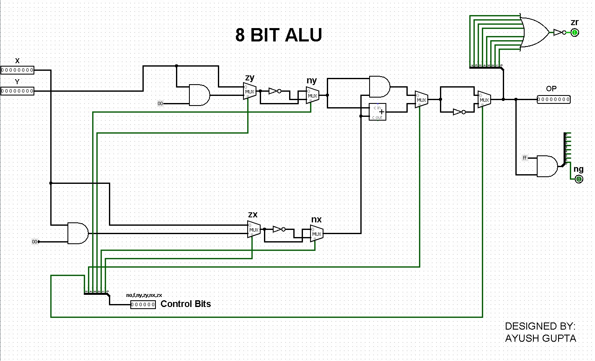
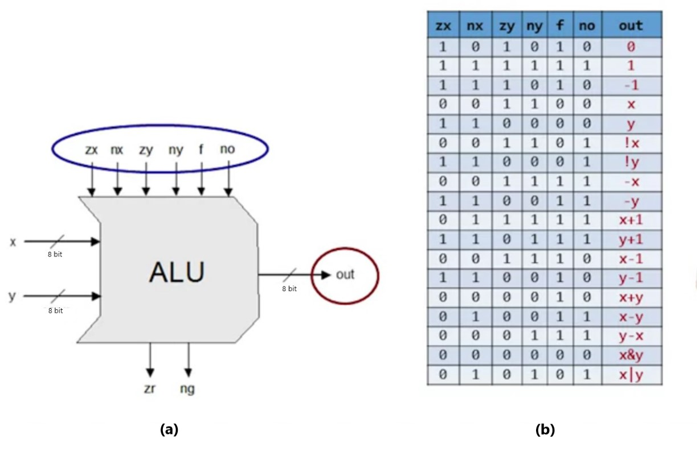
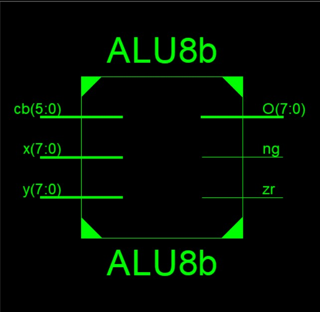
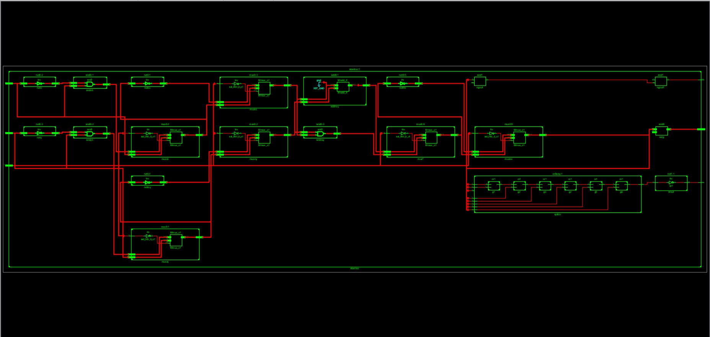
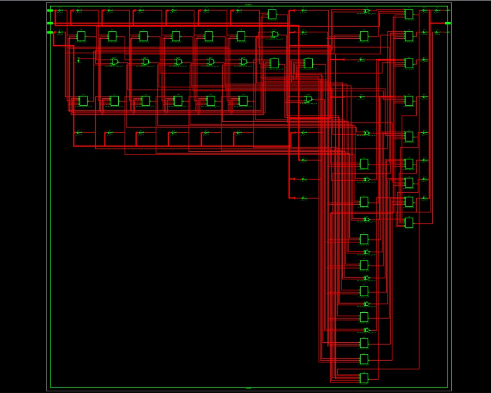

# RTL Design and Analysis of an 8-bit ALU using Xilinx ISE Design Suite

This repository showcases the RTL [Register Transfer Level] coding of an 8-bit Arithmetic Logic Unit as well as its Synthesis and Analysis done using the Xilinx ISE Design Suite 14.7 and ISim.

# Table of Contents
 * [Introduction](#Introduction)
 * [Approach](#Approach)
 * [Design Methodology and Explanation](#Design-Methodology-and-Explanation)
 * [Tools Used](#Tools-Used)
 * [RTL Coding and Simulation](#RTL-Coding-and-Simulation)
 * [Synthesis and Analysis](#Synthesis-and-Analysis)
 * [Conclusion](#Conclusion)
 * [Author](#Author)
 * [Acknowledgements](#Acknowledgements)
 * [References](#References)

# Introduction

We all use devices capable of performing millions and billions of computations in the blink of an eye all throughout our daily lives, don't we? But, have we wondered how is this computation taking place? What helps them in performing these tasks in such a short amount of time? This is where the CPU [Central Processing Unit] comes into the picture. The heart of any computing system is its CPU and the heart of any CPU is the ALU!! 
The Arithmetic Logic Unit which lies at the centre of any processing unit is the epicentre of all the operations the CPU performs to get our tasks done. It is the fundamental building block responsible for all sorts of arithmetic, logical or relational operations. 

Modern CPUs contain very powerful and complex which are constantly working and performing basic arithmetic and logic operations involving addition, subtraction, multiplication, and division; comparisons of values i.e. relatinoal operations and also the logical operations such as NOT, AND, and OR In addition to ALUs, modern CPUs contain a control unit (CU) as well whose job is to let the ALU know what operation to perform.
All information is stored and manipulated in the form of binary, of course, and transistor switches are used to manipulate binary numbers since there are only two possible states of a switch: open or closed. An open transistor, through which there is no current, represents a 0. A closed transistor, through which there is a current, represents a 1 and all the required operations are then performed by these multiple transistors connected with each other. 

# Approach

As mentioned earlier, all modern CPUs have a control unit[CU] apart from an ALU. It is the CU which tells the ALU what operation or function it has to perform on the data and the CU does it using a certain set of bits called control bits, and the ALU stores the result of this operation in an output register. 
Now, before we can actually write the RTL code for our ALU, it is important to first know whether the logic with which our ALU is being designed will actually work or not, and so, in order to do that, the digital circuit using basic combinational blocks was designed using Logisim software to check whether the desired output is generated by the ALU or not. Then after doing this, we come to the Xilinx Design Suite wherein this circuit will serve as reference when for writing our VHDL code using structural modelling style. This will then be followed by the simulation of the testbench of our design and finally the Synthesis and Analysis of the entire design.

# Design Methodology and Explanation

## ALU Design

 
  Fig 1: Reference Logic Diagram

Figure above represents the logic diagram used as reference when designing our RTL code.
Here, we can see that X and Y are the two 8-bit input registers going into the ALU while OP is our output register. Along with that, the ALU also has the very important six control bits viz. zx, nx, zy, ny, f, no. These 6 control bits are the ones which decide which operation will the ALU perform. The ALU also has two single bit staus flags labelled above as zr and ng.

The ALU can perform 18 different logical, arithmetic and relational operations depending upon what the values of the control bits are. The truth table for this along with the block diagram of the ALU are given below.

 
  Fig 2: (a) Block Diagram (b) Operations Truth Table 

The two status flags, Zr (zero) and Ng (negative) and one out (output) will give us the desired output based on the following criterion:
•	Zr – indicates that the operation performed on inputs resulted in zero (for comparison if both inputs are equal).

•	Ng– indicates the operation performed on the inputs resulted in negative output.

•	OUT – result obtained after some consecutive operations performed on the input

## Working Principle

Multiplexor is one of the most powerful gates in logic design as it provides the function of decision making at hardware level. The ALU accepts two 8 bit inputs and a series of function is performed as listed below:
1. if (zx == 1) set x = 0 (8-bit constant)
2.  if (nx == 1) set x =! x (bitwise not)
3. if (zy == 1) set y = 0 (8-bit constant)	
4. if (ny == 1) set y =! y (bitwise not)
5. if (f == 1) set out = x + y (integer 2's complement addition)
6. if (f == 0) set out = x & y (bitwise and)
7. if (no == 1) set out =! out (bitwise not)
8. if (out == 0) set zr = 1
9. if (out < 0) set ng = 1  

Using the above series of simple logical operations, fundamental arithmetic operations can be performed.

In the above sequence of steps there are 6 control bits if any of the control bit is set to 1 it will perform a specific logical operation on the input as shown within the brackets, meaning of each control bit is listed below.
    1. zx, zero the x input?
    2. nx, negate the x input?
    3. zy, zero the y input?
    4. ny, negate the y input?
    5. f, compute out = x + y (if 1) or x & y (if 0)
    6. no, negate the out output? 

The basic design is that the output for each control bit a specific logical operation is performed first and then those outputs are passed through the multiplexor, the output which propagates further depends upon the selection bit if the multiplexor which is actually one of the six control bits. The user has to enter one of the 18 different combinations of the control bits and one of 18 different operations x+y, x-y, y-x, 0, 1, -1, x, y, -x, -y, !x, !y, x+1, y+1, x-1, y-1, x&y, x|y on two 8-bit inputs will be performed.

In order to check if the output is zero or not the output is split using a 8 bit splitter and an OR operation is performed on the output bits if any one of the 8 bits is 1 then the output is non- zero else the output is zero ,if all bits are zero then the OR operation on those bits will result in 0 therefore the indicator will turn to 0.
   
In order to check if the output is negative or not the most significant bit is used if it is one then the output is negative else it is positive (as followed in the 2’s complement system).

# Tools Used

<b>• Xilinx ISE Design Suite 14.7:</b> 
ISE® Design Suite is a proven and mature development environment for All Programmable devices. It is an impressive package that has got tools for boosting the designer productivity plus additionally, it supplies the flexible configurations of this Design Suite Editions.  
To know more, kindly refer to: <a href='https://www.xilinx.com/products/design-tools/ise-design-suite.html'>Xilinx ISE Design Suite</a> 

<b>• ISim Simulator:</b> 
ISim provides a complete, full-featured HDL simulator integrated within ISE. HDL simulation now can be an even more fundamental step within your design flow with the tight integration of the ISim within your design environment.
To know more, kindly refer to: <a href='https://www.xilinx.com/products/design-tools/isim.html'>Xilinx ISim</a> 

<b>• Logisim:</b> 
Logisim is an educational tool for designing and simulating digital logic circuits.

# RTL Coding and Simulation

## VHDL Coding:

The VHDL codes of the 8-bit ALU were designed using behavioral as well as structural modelling. The truth table shown in Fig 2 above was used as reference for the behavioral model and the logic diagram shown in Fig 1 was used as reference for structural model.

For Behavioral Design, kindly refer to: <a href='https://github.com/guptayush2112/Project-ALU-/tree/main/VHDL%20Source%20Codes/Behavioral%20Modelling'>Behavioral Model</a> 

For Structural Design, kindly refer to: <a href='https://github.com/guptayush2112/Project-ALU-/tree/main/VHDL%20Source%20Codes/Structural%20Modelling'>Structural Model</a> 

## Testbench Simulation:

After completing the coding and writing the testbench as well, the ALU testbench for Structural model was now simulated using the Xilinx ISim as shown in the two images below.

For the Testbench Design, X and Y were taken initially as 00010010 and 00001010.

For the different values of control bits we can see how the output labelled as o is changing.
Moreover, the zr bit goes to high [1]to indicate that the output we've got from the ALU is zero and ng goes to high [1] to indicate that the output is a signed binary number. Thus, with the functionality of the ALU as per the table in Fig 2(b) was hence verified.

   
  Fig. 3 (a): Testbench of 8-bit ALU [Till 350ns]

   
  Fig. 3 (b): Testbench of 8-bit ALU [Contd till 900ns]

Note: Since the port declarations inside the ALU entity of both Structural and Behavioral model are same and the testbench stimulus given to both is same, meaning that the testbench of behavioral modelling style is similar to that of the structural modelling, hence the simulation of only one, that is, the structural model is shown here.

# Synthesis and Analysis

Initially, after the function implementation of the design was verified through the testbench simulation, the design was then synthesized to get the RTL and Technology view of the same.

## Top-Level Block:

   

## Detailed RTL View:

   

## Detailed Technology View:  

   

# Synthesis Report:

## Synthesis Summary:

	=========================================================================
	*                      Synthesis Options Summary                        *
	=========================================================================
	---- Source Parameters
	Input File Name                    : "ALU8b.prj"
	Input Format                       : mixed
	Ignore Synthesis Constraint File   : NO

	---- Target Parameters
	Output File Name                   : "ALU8b"
	Output Format                      : NGC
	Target Device                      : xc3s100e-5-vq100

	---- Source Options
	Top Module Name                    : ALU8b
	Automatic FSM Extraction           : YES
	FSM Encoding Algorithm             : Auto
	Safe Implementation                : No
	FSM Style                          : LUT
	RAM Extraction                     : Yes
	RAM Style                          : Auto
	ROM Extraction                     : Yes
	Mux Style                          : Auto
	Decoder Extraction                 : YES
	Priority Encoder Extraction        : Yes
	Shift Register Extraction          : YES
	Logical Shifter Extraction         : YES
	XOR Collapsing                     : YES
	ROM Style                          : Auto
	Mux Extraction                     : Yes
	Resource Sharing                   : YES
	Asynchronous To Synchronous        : NO
	Multiplier Style                   : Auto
	Automatic Register Balancing       : No

	---- Target Options
	Add IO Buffers                     : YES
	Global Maximum Fanout              : 100000
	Add Generic Clock Buffer(BUFG)     : 24
	Register Duplication               : YES
	Slice Packing                      : YES
	Optimize Instantiated Primitives   : NO
	Use Clock Enable                   : Yes
	Use Synchronous Set                : Yes
	Use Synchronous Reset              : Yes
	Pack IO Registers into IOBs        : Auto
	Equivalent register Removal        : YES

	---- General Options
	Optimization Goal                  : Speed
	Optimization Effort                : 1
	Keep Hierarchy                     : No
	Netlist Hierarchy                  : As_Optimized
	RTL Output                         : Yes
	Global Optimization                : AllClockNets
	Read Cores                         : YES
	Write Timing Constraints           : NO
	Cross Clock Analysis               : NO
	Hierarchy Separator                : /
	Bus Delimiter                      : <>
	Case Specifier                     : Maintain
	Slice Utilization Ratio            : 100
	BRAM Utilization Ratio             : 100
	Verilog 2001                       : YES
	Auto BRAM Packing                  : NO
	Slice Utilization Ratio Delta      : 5

	=========================================================================

## Design Summary:

	=========================================================================
	*                            Design Summary                               *
	=========================================================================
	Final Results
	RTL Top Level Output File Name     : ALU8b.ngr
	Top Level Output File Name         : ALU8b
	Output Format                      : NGC
	Optimization Goal                  : Speed
	Keep Hierarchy                     : No

	Design Statistics
	# IOs                              : 32

	Cell Usage :
	# BELS                             : 66
	#      GND                         : 1
	#      LUT3                        : 24
	#      LUT4                        : 18
	#      MUXCY                       : 7
	#      MUXF5                       : 8
	#      XORCY                       : 8
	# IO Buffers                       : 32
	#      IBUF                        : 22
	#      OBUF                        : 10
	=========================================================================

	Device utilization summary:
	---------------------------

	Selected Device : 3s100evq100-5 

	 Number of Slices:                       22  out of    960     2%  
	 Number of 4 input LUTs:                 42  out of   1920     2%  
	 Number of IOs:                          32
	 Number of bonded IOBs:                  32  out of     66    48%  

	---------------------------
	Partition Resource Summary:
	---------------------------
	No Partitions were found in this design.
	---------------------------

## Timing Report

	Timing Detail:
	--------------
	All values displayed in nanoseconds (ns)

	=========================================================================
	Timing constraint: Default path analysis
	  Total number of paths / destination ports: 1450 / 10
	-------------------------------------------------------------------------
	Delay:               12.181ns (Levels of Logic = 15)
	  Source:            cb<5> (PAD)
	  Destination:       zr (PAD)

	  Data Path: cb<5> to zr
					Gate     Net
	    Cell:in->out      fanout   Delay   Delay  Logical Name (Net Name)
	    ----------------------------------------  ------------
	     IBUF:I->O            15   1.106   1.016  cb_5_IBUF (cb_5_IBUF)
	     LUT3:I0->O            2   0.612   0.532  muxxc/o<0>1 (Xf<0>)
	     LUT4:I0->O            1   0.612   0.000  addnxy/Madd_t_Madd_lut<0> (addnxy/Madd_t_Madd_lut<0>)
	     MUXCY:S->O            1   0.404   0.000  addnxy/Madd_t_Madd_cy<0> (addnxy/Madd_t_Madd_cy<0>)
	     MUXCY:CI->O           1   0.051   0.000  addnxy/Madd_t_Madd_cy<1> (addnxy/Madd_t_Madd_cy<1>)
	     MUXCY:CI->O           1   0.051   0.000  addnxy/Madd_t_Madd_cy<2> (addnxy/Madd_t_Madd_cy<2>)
	     MUXCY:CI->O           1   0.051   0.000  addnxy/Madd_t_Madd_cy<3> (addnxy/Madd_t_Madd_cy<3>)
	     MUXCY:CI->O           1   0.051   0.000  addnxy/Madd_t_Madd_cy<4> (addnxy/Madd_t_Madd_cy<4>)
	     MUXCY:CI->O           1   0.051   0.000  addnxy/Madd_t_Madd_cy<5> (addnxy/Madd_t_Madd_cy<5>)
	     XORCY:CI->O           2   0.699   0.410  addnxy/Madd_t_Madd_xor<6> (nxaddy<6>)
	     LUT4:I2->O            1   0.612   0.000  muxno/o<6>11 (muxno/o<6>1)
	     MUXF5:I1->O           2   0.278   0.532  muxno/o<6>1_f5 (O_6_OBUF)
	     LUT4:I0->O            1   0.612   0.360  zrout/op_SW0 (N18)
	     LUT4:I3->O            1   0.612   0.357  zrout/op (zr_OBUF)
	     OBUF:I->O                 3.169          zr_OBUF (zr)
	    ----------------------------------------
	    Total                     12.181ns (8.973ns logic, 3.207ns route)
					       (73.7% logic, 26.3% route)
	
	    Maximum combinational path delay: 12.181ns
	=========================================================================
	
## XPower Analyzer Report
	2.  Power Summary
	2.1.  On-Chip Power Summary
	-----------------------------------------------------------------------------
	|                           On-Chip Power Summary                           |
	-----------------------------------------------------------------------------
	|        On-Chip        | Power (mW) |  Used  | Available | Utilization (%) |
	-----------------------------------------------------------------------------
	| Clocks                |       0.00 |      0 |    ---    |       ---       |
	| Logic                 |       0.00 |     42 |      1920 |               2 |
	| Signals               |       0.00 |     59 |    ---    |       ---       |
	| IOs                   |       0.00 |     32 |        66 |              48 |
	| Static Power          |      33.59 |        |           |                 |
	| Total                 |      33.59 |        |           |                 |
	-----------------------------------------------------------------------------

	2.2.  Thermal Summary
	------------------------------
	|      Thermal Summary       |
	------------------------------
	| Effective TJA (C/W) | 49.0 |
	| Max Ambient (C)     | 83.4 |
	| Junction Temp (C)   | 26.6 |
	------------------------------

	2.3.  Power Supply Summary
	---------------------------------------------------------
	|                 Power Supply Summary                  |
	---------------------------------------------------------
	|                      | Total | Dynamic | Static Power |
	---------------------------------------------------------
	| Supply Power (mW)    | 33.59 | 0.00    | 33.59        |
	---------------------------------------------------------

# Conclusion:
Thus, the design and analysis of the 8-bit Arithmetic Logic Unit was successfully done and it was observed that the ALU was performing all the 18 different operations as required. 

# Author:
• Ayush Gupta, B.Tech(ECE), SRM Institute of Science and Technology, Kattankulattur, Chennai-603203.

# References:
[1] Arithmetic Logic Units/Function Generators Datasheet, Texas Instruments, Dallas, Texas, 1988. [Online]. Available: http://www-s.ti.com/sc/ds/sn54s181.pdf 
[2] Build a Modern Computer from First Principles: From Nand to Tetris (Project-Centered Course) by Hebrew University of Jerusalem
